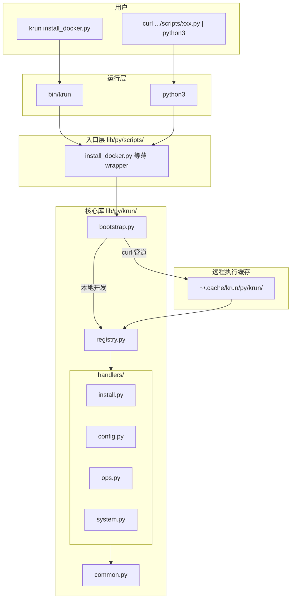
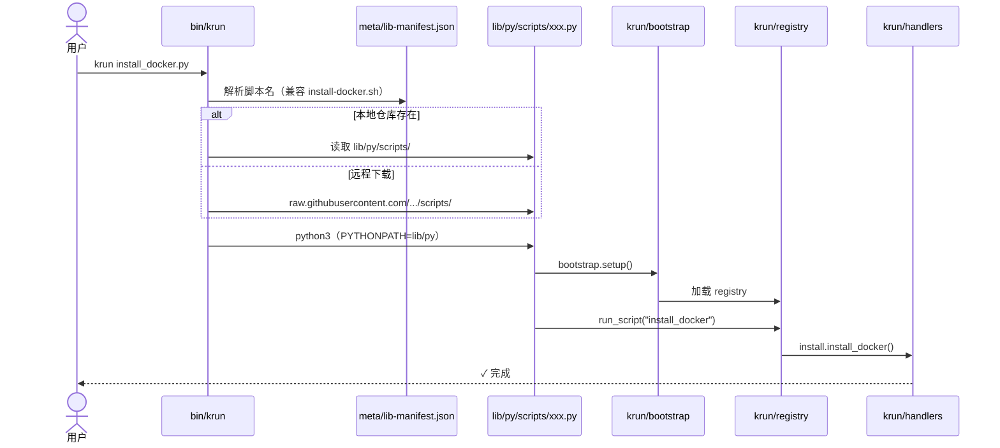
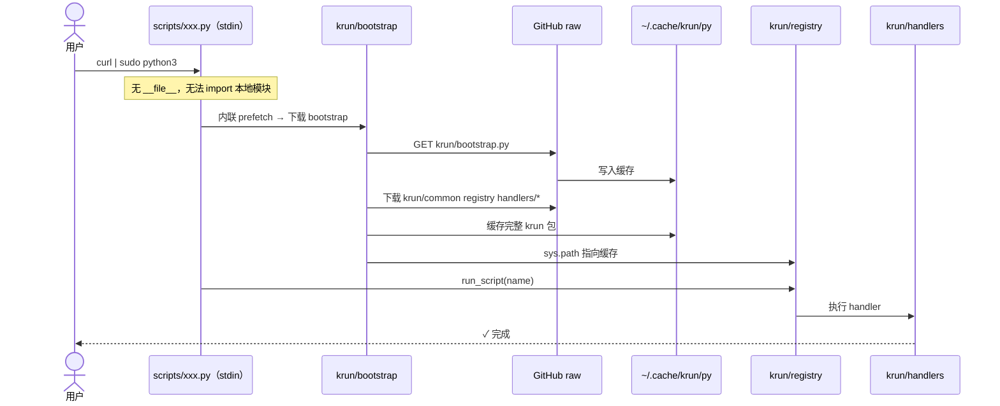

# Krun - 运维自动化脚本工具集

```
______
___  /____________  ________
__  //_/_  ___/  / / /_  __ \
_  ,<  _  /   / /_/ /_  / / /
/_/|_| /_/    \__,_/ /_/ /_/
       Ops Script Runner
```

[](https://opensource.org/licenses/MIT)
[](https://github.com/kevin197011/krun)
[](https://github.com/kevin197011/krun/tree/main/lib)

## 项目简介

Krun 是一个面向运维工程师的脚本工具集，提供 **Shell** 与 **Python** 两类运维脚本，覆盖系统初始化、安全加固、服务部署、性能优化等场景。支持 CentOS/RHEL、Debian/Ubuntu、macOS 等多个平台，可通过 curl 直接执行。

### 目录结构

```
krun/
├── bin/krun                 # CLI 运行器
├── meta/lib-manifest.json   # 脚本清单
├── lib/
│   ├── sh/
│   │   └── install-python3.sh   # 唯一 Shell 脚本（安装 Python3 依赖）
│   └── py/
│       ├── krun/                # 核心库（不直接 curl）
│       │   ├── bootstrap.py     # 远程执行时拉取依赖
│       │   ├── common.py        # 平台检测、装包、run()
│       │   ├── registry.py      # 脚本名 → handler
│       │   └── handlers/        # 业务逻辑
│       │       ├── install.py
│       │       ├── config.py
│       │       ├── ops.py
│       │       └── system.py
│       ├── scripts/             # 可执行入口（79 个薄 wrapper）
│       └── generate_wrappers.py # rake lib:py:generate
└── install.sh               # 安装 krun CLI
```

### 项目架构



### 调用流程

**方式 A：krun CLI（本地优先，无本地则拉 GitHub）**



**方式 B：curl 管道（无需克隆仓库）**



**开发者新增脚本**


### 核心特性

- 🚀 **一键安装**: 80+ 运维脚本，按语言分目录管理
- 🔧 **系统配置**: 完善的系统初始化和安全加固脚本
- 🌐 **多平台支持**: CentOS/RHEL 7-9、Debian/Ubuntu、macOS
- 📦 **模块化设计**: 每个脚本独立运行，可单独使用或组合使用
- 🔒 **安全可靠**: MIT 许可证，所有脚本开源可审查
- 🎯 **远程执行**: 支持 curl 直接执行，无需克隆仓库
- ⚡ **自动依赖**: 安装脚本自动检测并安装所需依赖（Python3、curl 等）
- 🐚 **Shell 脚本**: `lib/sh/*.sh`，通过 bash 执行
- 🐍 **Python 脚本**: `lib/py/scripts/*.py`，通过 python3 执行

## 主要功能

### 系统配置
- **系统基线配置**: 安全加固、内核参数优化、SSH配置
- **软件源配置**: CentOS 7/Rocky Linux 软件源配置
- **基础软件安装**: 常用运维工具包安装
- **系统性能优化**: 内核参数、网络、存储性能调优

### 服务部署
- **容器服务**: Docker 安装配置
- **开发环境**: Python、Node.js、Go、Ruby 环境安装
- **数据库**: MySQL、PostgreSQL、Redis、MongoDB 部署
- **Web服务**: Nginx、Apache 配置

### 运维工具
- **监控工具**: Node Exporter、系统监控脚本
- **日志管理**: 日志轮转、清理脚本
- **备份工具**: 数据备份、配置备份脚本
- **网络工具**: 网络诊断、性能测试工具

## 快速开始

### 方式一：安装 Krun 工具（推荐）

```bash
# 一键安装（自动检测平台并安装依赖）
curl -fsSL https://raw.githubusercontent.com/kevin197011/krun/main/install.sh | bash

# 重新加载 shell 配置
source ~/.bashrc  # 或 source ~/.zshrc

# 查看可用脚本列表
krun list

# 执行脚本（自动下载并执行；兼容旧 kebab-case 名称）
krun install_docker.py
krun install-docker.sh      # 兼容旧名
krun init_system.py
krun install-python3.sh     # 唯一保留的 shell 脚本
```

**安装说明**：
- 支持 macOS 和 Linux（CentOS/RHEL、Debian/Ubuntu）
- 自动检测平台并安装所需依赖（Python3、curl）
- 自动配置 PATH 环境变量
- 安装目录：`~/.krun/bin/krun`
- krun 工具管理 `lib/py/scripts/` 下的 Python 脚本；`lib/sh/` 仅保留 `install-python3.sh`
- 本地开发时 `krun` 优先读仓库内文件，再回退 GitHub raw

### 方式二：直接执行脚本

```bash
# Docker 安装
curl -fsSL https://raw.githubusercontent.com/kevin197011/krun/main/lib/py/scripts/install_docker.py | sudo python3

# FFmpeg 安装
curl -fsSL https://raw.githubusercontent.com/kevin197011/krun/main/lib/py/scripts/install_ffmpeg.py | sudo python3

# Rocky Linux 仓库配置
curl -fsSL https://raw.githubusercontent.com/kevin197011/krun/main/lib/py/scripts/config_rocky_repo.py | sudo python3

# 系统初始化与性能优化
curl -fsSL https://raw.githubusercontent.com/kevin197011/krun/main/lib/py/scripts/init_system.py | sudo python3

# Python3 依赖安装（唯一 shell 脚本）
curl -fsSL https://raw.githubusercontent.com/kevin197011/krun/main/lib/sh/install-python3.sh | bash
```

### 方式三：本地使用

```bash
# 克隆仓库
git clone https://github.com/kevin197011/krun.git
cd krun

# 方式 3.1: 使用安装脚本安装 krun 工具
./install.sh
source ~/.bashrc  # 或 source ~/.zshrc
krun list

# 方式 3.2: 直接执行脚本
./lib/py/scripts/install_docker.py
./lib/py/scripts/init_system.py

# 方式 3.3: 使用本地 krun 工具
./bin/krun install_git.py
```

## 脚本列表

共 80 个脚本（79 Python + 1 Shell）。命名统一为 `snake_case.py`，完整清单：

```bash
krun list
# 或
cat meta/lib-manifest.json
```

主要分类：

| 类别 | 示例 |
|------|------|
| 系统初始化 | `init_system.py`, `config_system_baseline.py`, `disable_firewall_selinux.py` |
| 软件源/磁盘 | `config_rocky_repo.py`, `config_disk_data.py`, `disk_cleanup.py` |
| 安装类 | `install_docker.py`, `install_nginx.py`, `install_golang.py` |
| 运维工具 | `deploy_node_exporter.py`, `crane_copy.py`, `check_ip_quality.py` |
| 开发环境 | `install_asdf.py`, `install_oh_my_zsh.py`, `install_rbenv.py` |

`lib/sh/` 仅保留 `install-python3.sh`（安装 Python3 运行依赖）。

## 支持平台

- **CentOS/RHEL**: 7, 8, 9
- **Rocky Linux**: 8, 9
- **AlmaLinux**: 8, 9
- **Debian**: 10, 11, 12
- **Ubuntu**: 18.04, 20.04, 22.04, 24.04
- **macOS**: 10.15+ (部分脚本)

## 使用示例

### 新服务器初始化

```bash
# 1. 安装 krun 工具
curl -fsSL https://raw.githubusercontent.com/kevin197011/krun/main/install.sh | bash
source ~/.bashrc

# 2. 系统基础配置
krun disable_firewall_selinux.py
krun config_system_baseline.py
krun config_ssh.py
krun init_system.py

# 3. 安装常用软件
krun install_docker.py
krun install_git.py
krun install_vim.py

# 4. 配置开发环境
krun install-python3.sh
krun install_golang.py
krun install_oh_my_zsh.py
```

### Rocky Linux 9 修复 IPv6 源问题

```bash
# 修复 Rocky Linux 9 的 IPv6 源导致的包管理器问题
curl -fsSL https://raw.githubusercontent.com/kevin197011/krun/main/lib/py/scripts/config_rocky_repo.py | sudo python3
```

### Kubernetes 环境搭建

```bash
krun install_docker.py
krun install_kind.py
krun install_helm.py
krun install_k9s.py
```

### 自动挂载数据盘

```bash
# 自动格式化并挂载数据盘到 /data
data_disk="/dev/sdb" mount_point="/data" sudo python3 lib/py/scripts/config_disk_data.py
```

## 注意事项

1. **权限要求**: 大部分脚本需要 root 或 sudo 权限执行
2. **备份重要**: 脚本会自动备份原始配置文件到 `.bak` 或 `backup/` 目录
3. **网络要求**: 需要稳定的网络连接下载软件包
4. **测试环境**: 建议先在测试环境验证脚本功能
5. **安全审查**: 执行前请审查脚本内容，确保符合安全要求
6. **平台兼容**: 部分脚本仅支持特定平台，请查看脚本说明

## 开发者指南

### Python 模块职责

| 模块 | 路径 | 职责 |
|------|------|------|
| 入口 | `lib/py/scripts/*.py` | 薄 wrapper，`curl \| python3` 可执行 |
| 引导 | `krun/bootstrap.py` | 远程执行时下载/缓存核心库 |
| 注册 | `krun/registry.py` | `脚本名 → handler` 映射表 |
| 公共 | `krun/common.py` | `platform()`、`install_packages()`、`run()` |
| 安装 | `krun/handlers/install.py` | Docker、Helm、包管理器等 |
| 配置 | `krun/handlers/config.py` | SSH、磁盘、软件源、时区等 |
| 运维 | `krun/handlers/ops.py` | 磁盘清理、crane、部署等 |
| 网络 | `krun/handlers/network.py` | `check_ip_quality` 公网质量检测 |
| 初始化 | `krun/handlers/system.py` | `init_system` 系统调优 |

更细的目录说明见 [`lib/py/README.md`](lib/py/README.md)。

### 创建新脚本

```bash
# 1. 在 krun/handlers/ 添加逻辑
# 2. 在 krun/registry.py 的 SCRIPTS 注册名称
# 3. 生成入口并更新清单
rake lib:py:generate   # → lib/py/scripts/ + meta/lib-manifest.json
```

## 贡献指南

欢迎提交 Issue 和 Pull Request 来改进项目：

1. Fork 本仓库
2. 创建功能分支 (`git checkout -b feature/new-script`)
3. 按照标准格式编写脚本
4. 测试脚本在不同平台的兼容性
5. 提交更改 (`git commit -am 'Add new script'`)
6. 推送到分支 (`git push origin feature/new-script`)
7. 创建 Pull Request

## 常见问题

### Q: curl 执行报 ModuleNotFoundError？
远程 `curl | python3` 首次运行会从 GitHub 下载 `krun/` 核心库到 `~/.cache/krun/py/`。确保：
1. 使用 `lib/py/scripts/` 路径（非旧的 `lib/py/xxx.py`）
2. 网络可访问 `raw.githubusercontent.com`
3. 强制刷新缓存：`KRUN_REFRESH=1 curl ... | sudo python3`

### Q: 缓存后 GitHub 更新了，本地还是旧逻辑？
`bootstrap` 每次执行会比对远程 `krun/VERSION` 与本地缓存版本，**不一致时自动重新下载**全部核心模块，一般无需手动清缓存。

仍看到旧输出时（例如只 ping 两个 DNS）：
```bash
# 立即强制刷新
KRUN_REFRESH=1 curl -fsSL https://raw.githubusercontent.com/kevin197011/krun/main/lib/py/scripts/check_ip_quality.py | sudo python3

# 或删除缓存目录
rm -rf ~/.cache/krun/py
```

缓存目录：`~/.cache/krun/py/krun/`（可用 `KRUN_PY_CACHE` 自定义路径）。

### Q: 如何更新 krun 工具？
```bash
# 重新运行安装脚本即可（会自动下载最新版本）
curl -fsSL https://raw.githubusercontent.com/kevin197011/krun/main/install.sh | bash
source ~/.bashrc  # 或 source ~/.zshrc
```

### Q: 如何查看所有可用脚本？
```bash
# 使用 krun 工具查看脚本列表
krun list

# 或直接查看 lib 目录
ls -l lib/sh/*.sh lib/py/scripts/*.py
```

### Q: 脚本执行失败怎么办？
1. 检查是否有 root/sudo 权限
2. 检查网络连接是否正常
3. 查看错误日志，定位具体问题
4. 提交 Issue 描述问题和环境信息

### Q: 如何卸载 krun？
```bash
# 删除安装目录
rm -rf ~/.krun

# 删除 PATH 配置
# 编辑 ~/.bashrc 或 ~/.zshrc，删除 krun 相关的 PATH 配置
```

### Q: 安装脚本会自动安装依赖吗？
```bash
# 是的，install.sh 会自动检测并安装所需依赖：
# - macOS: 使用 Homebrew 安装 Python3 和 curl（如未安装 Homebrew 会自动安装）
# - Linux: 使用系统包管理器（apt/yum/dnf）安装 Python3 和 curl
# 如果系统已有这些依赖，则跳过安装步骤
```

## 许可证

本项目采用 MIT 许可证，详情请查看 [LICENSE](LICENSE) 文件。

## 相关资源

- 📚 [项目文档](https://github.com/kevin197011/krun/wiki)
- 💬 [问题反馈](https://github.com/kevin197011/krun/issues)
- 🔄 [更新日志](https://github.com/kevin197011/krun/releases)
- 🌟 [脚本示例](https://github.com/kevin197011/krun/tree/main/examples)

---

**项目地址**: https://github.com/kevin197011/krun
**作者**: [kevin197011](https://github.com/kevin197011)
**更新时间**: 2026-07-02
**脚本数量**: 80+
**支持平台**: CentOS/RHEL 7-9、Debian/Ubuntu、macOS

**Star ⭐ 支持项目发展！**