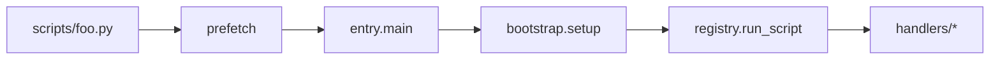

# lib/py layout

```
lib/py/
├── krun/                 # core library
│   ├── prefetch.py       # stage 1: sys.path (curl pipe inline)
│   ├── bootstrap.py      # stage 2: cache sync
│   ├── entry.py          # stage 3: main(script)
│   ├── common.py
│   ├── registry.py       # stage 4: dispatch
│   └── handlers/         # stage 5: logic
├── scripts/              # generated stubs (curl targets)
└── generate_wrappers.py
```

Call chain:



Add a script: handler → `registry.py` → `rake lib:py:generate`
